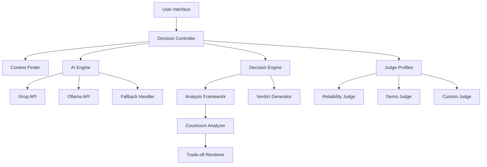

# Design Document: HackCourt

## Overview

HackCourt is a specialized technical decision assistant that helps hackathon teams make fast, constraint-driven choices between technical options. Unlike generic decision-making tools, HackCourt is optimized for the unique pressures of hackathon environments: extreme time constraints (24-48 hours), diverse team skills, and demo-focused outcomes.

The system uses a courtroom metaphor to make technical analysis engaging and memorable, while providing verdict-first recommendations that respect the urgency of hackathon decision-making. The core innovation is the constraint-driven reasoning engine that weighs factors specifically relevant to hackathon success rather than general software engineering best practices.

## Architecture

### Core Components



### System Flow

1. **Context Gathering**: Collect team composition, hackathon constraints, and technical options
2. **Judge Selection**: Choose or configure decision weighting profile
3. **AI Analysis**: Attempt AI-powered analysis via Groq API, fallback to Ollama, then deterministic rules
4. **Response Validation**: Validate AI responses against strict JSON schemas
5. **Verdict Generation**: Produce immediate recommendation with confidence level
6. **Courtroom Presentation**: Structure detailed analysis using legal metaphors
7. **Trade-off Visualization**: Present key differences in scannable format

## Components and Interfaces

### AI Engine

The AI-powered decision engine that provides intelligent analysis using external AI services.

```typescript
interface AIEngine {
  getAIVerdict(casePayload: CasePayload): Promise<AIVerdict | null>
}

interface CasePayload {
  mode: 'compare' | 'advisory'
  options?: TechnicalOption[]  // For compare mode
  context: HackathonContext
  judge: JudgeProfile
  projectDescription?: string  // For advisory mode
}

interface AIVerdict {
  mode: 'compare' | 'advisory'
  // Compare mode response
  winner?: 'Option A' | 'Option B'
  confidence?: 'high' | 'medium' | 'low'
  reasoning?: string
  evidence?: Evidence[]
  warning?: Warning | null
  // Advisory mode response  
  stackName?: string
  stack?: string[]
  rejectedAlternatives?: string[]
}

interface Evidence {
  id: string
  title: string
  explanation: string
  beneficiary?: 'Option A' | 'Option B' | 'Both'  // Compare mode only
}

interface Warning {
  severity: 'low' | 'medium' | 'high'
  reason: string
}

class AIEngineImpl implements AIEngine {
  private groqTimeout = 2000
  private ollamaEndpoint = 'http://localhost:11434'
  
  async getAIVerdict(casePayload: CasePayload): Promise<AIVerdict | null> {
    // Race between Groq and Ollama
    const groqPromise = this.queryGroq(casePayload)
    const ollamaPromise = this.queryOllama(casePayload)
    
    try {
      const result = await Promise.race([groqPromise, ollamaPromise])
      return this.validateResponse(result, casePayload.mode)
    } catch (error) {
      console.warn('AI services failed, falling back to deterministic engine')
      return null
    }
  }
  
  private validateResponse(response: any, mode: string): AIVerdict | null {
    // Strict JSON schema validation
    if (mode === 'compare') {
      return this.validateCompareResponse(response)
    } else {
      return this.validateAdvisoryResponse(response)
    }
  }
}
```

### Decision Controller

The main orchestrator that manages the decision-making process with AI integration.

```typescript
interface DecisionController {
  startDecision(options: TechnicalOption[]): DecisionSession
  gatherContext(session: DecisionSession): Promise<HackathonContext>
  selectJudge(session: DecisionSession, profile: JudgeProfile): void
  generateVerdict(session: DecisionSession): Promise<Verdict>
  presentAnalysis(session: DecisionSession): CourtroomAnalysis
}

class DecisionControllerImpl implements DecisionController {
  constructor(
    private aiEngine: AIEngine,
    private fallbackEngine: DecisionEngine
  ) {}
  
  async generateVerdict(session: DecisionSession): Promise<Verdict> {
    // Try AI first
    const aiResult = await this.aiEngine.getAIVerdict(session.casePayload)
    
    if (aiResult) {
      return this.convertAIToVerdict(aiResult)
    }
    
    // Fallback to deterministic engine
    return this.fallbackEngine.generateVerdict(session)
  }
}
```

### Context Finder

Gathers information about the hackathon environment and team constraints.

```typescript
interface ContextFinder {
  getTeamComposition(): TeamProfile
  getHackathonConstraints(): HackathonConstraints
  getProjectRequirements(): ProjectRequirements
  validateContext(context: HackathonContext): ValidationResult
}

interface HackathonContext {
  team: TeamProfile
  constraints: HackathonConstraints
  project: ProjectRequirements
  timestamp: Date
}

interface TeamProfile {
  size: number
  skillLevels: Map<Technology, SkillLevel>
  experience: ExperienceLevel
  roles: TeamRole[]
}

interface HackathonConstraints {
  duration: number // hours
  judgingCriteria: JudgingCriterion[]
  demoRequirements: DemoRequirement[]
  resources: AvailableResource[]
}
```

### Judge Profiles

Different weighting strategies for decision factors.

```typescript
interface JudgeProfile {
  name: string
  description: string
  weights: DecisionWeights
  evaluate(options: TechnicalOption[], context: HackathonContext): ScoredOption[]
}

interface DecisionWeights {
  timeToImplementation: number
  teamSkillAlignment: number
  demoReliability: number
  learningCurve: number
  integrationComplexity: number
  visualImpact: number
  scalability: number
  documentation: number
}

class ReliabilityJudge implements JudgeProfile {
  weights = {
    demoReliability: 0.3,
    teamSkillAlignment: 0.25,
    timeToImplementation: 0.2,
    learningCurve: 0.15,
    integrationComplexity: 0.1,
    visualImpact: 0.0,
    scalability: 0.0,
    documentation: 0.0
  }
}

class DemoJudge implements JudgeProfile {
  weights = {
    visualImpact: 0.3,
    timeToImplementation: 0.25,
    demoReliability: 0.2,
    teamSkillAlignment: 0.15,
    learningCurve: 0.1,
    integrationComplexity: 0.0,
    scalability: 0.0,
    documentation: 0.0
  }
}
```

### Decision Engine

Core reasoning system that evaluates technical options against hackathon constraints.

```typescript
interface DecisionEngine {
  analyzeOptions(
    options: TechnicalOption[], 
    context: HackathonContext, 
    judge: JudgeProfile
  ): AnalysisResult
  
  generateVerdict(analysis: AnalysisResult): Verdict
  calculateConfidence(analysis: AnalysisResult): ConfidenceLevel
}

interface AnalysisResult {
  scoredOptions: ScoredOption[]
  criticalFactors: DecisionFactor[]
  tradeoffs: Tradeoff[]
  risks: Risk[]
}

interface Verdict {
  recommendedOption: TechnicalOption
  confidence: ConfidenceLevel
  rationale: string
  alternativeConsideration?: string
}
```

### Courtroom Analyzer

Structures analysis using legal metaphors for engaging presentation.

```typescript
interface CourtroomAnalyzer {
  generateOpeningStatements(options: TechnicalOption[]): OpeningStatement[]
  presentEvidence(analysis: AnalysisResult): Exhibit[]
  raiseObjections(options: TechnicalOption[], context: HackathonContext): Objection[]
  deliverClosingArgument(verdict: Verdict, analysis: AnalysisResult): ClosingArgument
}

interface OpeningStatement {
  option: TechnicalOption
  promise: string
  keyStrengths: string[]
}

interface Exhibit {
  title: string
  evidence: string
  impact: ImpactLevel
  supportedOption: TechnicalOption
}

interface Objection {
  targetOption: TechnicalOption
  concern: string
  severity: SeverityLevel
  counterArgument?: string
}
```

## Data Models

### Core Entities

```typescript
interface TechnicalOption {
  id: string
  name: string
  category: TechnologyCategory
  description: string
  learningCurve: LearningCurve
  maturity: MaturityLevel
  ecosystem: EcosystemHealth
  documentation: DocumentationQuality
}

interface DecisionFactor {
  name: string
  description: string
  weight: number
  measurement: FactorMeasurement
}

interface Tradeoff {
  factor: DecisionFactor
  optionA: TechnicalOption
  optionB: TechnicalOption
  comparison: ComparisonResult
  significance: SignificanceLevel
}

enum ConfidenceLevel {
  HIGH = "high",
  MEDIUM = "medium", 
  LOW = "low"
}

enum LearningCurve {
  MINIMAL = "minimal",
  MODERATE = "moderate",
  STEEP = "steep",
  EXTREME = "extreme"
}

enum ImpactLevel {
  CRITICAL = "critical",
  SIGNIFICANT = "significant",
  MODERATE = "moderate",
  MINOR = "minor"
}
```

### Scoring Models

```typescript
interface ScoredOption {
  option: TechnicalOption
  totalScore: number
  factorScores: Map<string, number>
  strengths: string[]
  weaknesses: string[]
  hackathonFit: HackathonFitScore
}

interface HackathonFitScore {
  timeEfficiency: number
  skillMatch: number
  demoReadiness: number
  riskLevel: number
  overallFit: number
}
```

## Correctness Properties

*A property is a characteristic or behavior that should hold true across all valid executions of a system—essentially, a formal statement about what the system should do. Properties serve as the bridge between human-readable specifications and machine-verifiable correctness guarantees.*

### Property Analysis

Based on the requirements analysis, the following properties ensure HackCourt operates correctly across all valid inputs:

**Property 1: Primary factors comprehensive consideration**
*For any* technical option evaluation, the system should consider all primary hackathon factors: time-to-implementation, team skill alignment, demo reliability, learning curve steepness, and integration complexity
**Validates: Requirements 1.2, 1.3, 1.4, 1.5, 1.6**

**Property 2: Reliability judge weighting priority**
*For any* evaluation using the reliability-focused profile, demo reliability and team skill alignment should have the highest weights among all factors
**Validates: Requirements 2.3**

**Property 3: Demo judge weighting priority**
*For any* evaluation using the demo-focused profile, time-to-demo and visual impact should have the highest weights among all factors
**Validates: Requirements 2.4**

**Property 4: Custom profile creation**
*For any* custom weighting configuration, the system should create and apply a functional judge profile with the specified weights
**Validates: Requirements 2.5**

**Property 5: Verdict provision guarantee**
*For any* comparison between technical options, the system should provide a clear verdict with confidence level and rationale
**Validates: Requirements 3.1, 3.2, 3.3**

**Property 6: Low confidence uncertainty indication**
*For any* evaluation resulting in low confidence, the system should indicate uncertainty and suggest additional considerations
**Validates: Requirements 3.4**

**Property 7: Courtroom structure completeness**
*For any* analysis presentation, the output should contain opening statements, evidence exhibits, objections, and closing arguments
**Validates: Requirements 4.1, 4.2, 4.3, 4.4, 4.5**

**Property 8: Constraint-driven analysis**
*For any* technical option evaluation, the analysis should explicitly consider hackathon time constraints, team characteristics, and judging criteria rather than generic comparisons
**Validates: Requirements 5.1, 5.2, 5.3, 5.4**

**Property 9: Conflict resolution guidance**
*For any* scenario with conflicting constraints, the system should explain trade-offs and recommend prioritization
**Validates: Requirements 5.5**

**Property 10: Comprehensive context gathering**
*For any* decision session, the system should gather information about team composition, hackathon constraints, and project requirements
**Validates: Requirements 6.1, 6.2, 6.3**

**Property 11: Context-adaptive analysis**
*For any* two different contexts with the same technical options, the system should produce different analyses that reflect the contextual differences
**Validates: Requirements 6.4**

**Property 12: Assumption transparency**
*For any* incomplete context scenario, the system should make reasonable assumptions and clearly state them in the analysis
**Validates: Requirements 6.5**

**Property 13: Trade-off presentation structure**
*For any* trade-off presentation, the output should follow a structured format with visual indicators and emphasis on critical differences
**Validates: Requirements 7.1, 7.2, 7.3**

**Property 14: Close comparison emphasis**
*For any* evaluation where options have similar scores, the system should emphasize the deciding factors that differentiate them
**Validates: Requirements 7.4**

**Property 15: Presentation conciseness**
*For any* trade-off presentation, the content should remain within reasonable length limits to avoid overwhelming users
**Validates: Requirements 7.5**

**Property 16: AI integration priority**
*For any* decision request when AI services are available, the system should use AI-powered analysis instead of deterministic rules
**Validates: Requirements 11.1**

**Property 17: Groq API primary service**
*For any* decision request, the system should attempt to use Groq API first with a 2000ms timeout before trying other services
**Validates: Requirements 11.2**

**Property 18: Ollama fallback behavior**
*For any* decision request where Groq API fails or times out, the system should attempt to use Ollama at localhost:11434 as fallback
**Validates: Requirements 11.3**

**Property 19: Deterministic engine final fallback**
*For any* decision request where both AI services fail, the system should fall back to the existing deterministic rule-based engine
**Validates: Requirements 11.4**

**Property 20: AI response validation**
*For any* AI response received, the system should validate it against strict JSON schemas and reject invalid responses
**Validates: Requirements 11.5**

**Property 21: Compare mode AI response structure**
*For any* compare mode AI response, it should contain winner, confidence, reasoning, evidence, and optional warning fields matching the compare schema
**Validates: Requirements 11.6**

**Property 22: Advisory mode AI response structure**
*For any* advisory mode AI response, it should contain stackName, stack components, reasoning, evidence, and rejectedAlternatives fields matching the advisory schema
**Validates: Requirements 11.7**

**Property 23: AI response processing**
*For any* AI response, the system should process it through existing render functions rather than displaying raw AI text directly
**Validates: Requirements 11.8**

**Property 24: AI mode separation compliance**
*For any* AI response, it should conform to the appropriate mode contract (compare responses never contain advisory fields and vice versa)
**Validates: Requirements 11.9**

## Error Handling

### Input Validation

- **Invalid Technical Options**: System should reject options without required metadata (name, category, learning curve)
- **Incomplete Context**: System should prompt for missing critical information or make stated assumptions
- **Invalid Judge Profiles**: System should validate that weights sum to reasonable totals and cover required factors
- **Malformed Requests**: System should provide clear error messages for improperly formatted inputs

### Analysis Failures

- **Insufficient Data**: When options cannot be meaningfully compared, system should explain limitations and suggest additional information needed
- **Tie Scenarios**: When options score identically, system should acknowledge the tie and provide tie-breaking guidance
- **Extreme Constraints**: When constraints are impossible to satisfy, system should identify conflicts and suggest constraint relaxation

### Graceful Degradation

- **Missing Factor Data**: Use reasonable defaults for missing technical option attributes
- **Partial Context**: Proceed with analysis using available information and clearly state assumptions
- **Judge Profile Errors**: Fall back to balanced default weighting if custom profile is invalid

## Testing Strategy

### Dual Testing Approach

HackCourt will use both unit testing and property-based testing to ensure comprehensive correctness validation:

**Unit Tests** focus on:
- Specific examples of decision scenarios with known correct outcomes
- Edge cases like tie scores, missing data, and extreme constraints
- Integration points between components (context gathering → analysis → presentation)
- Error conditions and graceful degradation behaviors

**Property-Based Tests** focus on:
- Universal properties that hold across all valid inputs (Properties 1-15)
- Comprehensive input coverage through randomized technical options, contexts, and constraints
- Invariants that must be maintained regardless of specific inputs

### Property-Based Testing Configuration

- **Framework**: Use fast-check for TypeScript implementation
- **Test Iterations**: Minimum 100 iterations per property test to ensure thorough coverage
- **Test Tagging**: Each property test must reference its design document property
- **Tag Format**: `// Feature: hack-court, Property {number}: {property_text}`

### Testing Balance

- Property-based tests handle the bulk of input coverage and correctness validation
- Unit tests focus on specific scenarios, integration points, and error conditions
- Both approaches are necessary: unit tests catch concrete bugs, property tests verify general correctness

### Example Test Structure

```typescript
// Feature: hack-court, Property 1: Primary factors comprehensive consideration
test('evaluation considers all primary hackathon factors', () => {
  fc.assert(fc.property(
    arbitraryTechnicalOptions(),
    arbitraryHackathonContext(),
    (options, context) => {
      const analysis = decisionEngine.analyzeOptions(options, context, defaultJudge);
      const consideredFactors = analysis.criticalFactors.map(f => f.name);
      
      expect(consideredFactors).toContain('time-to-implementation');
      expect(consideredFactors).toContain('team-skill-alignment');
      expect(consideredFactors).toContain('demo-reliability');
      expect(consideredFactors).toContain('learning-curve');
      expect(consideredFactors).toContain('integration-complexity');
    }
  ));
});
```

This comprehensive testing strategy ensures that HackCourt provides reliable, constraint-driven technical decision support for hackathon teams while maintaining the engaging courtroom presentation format.